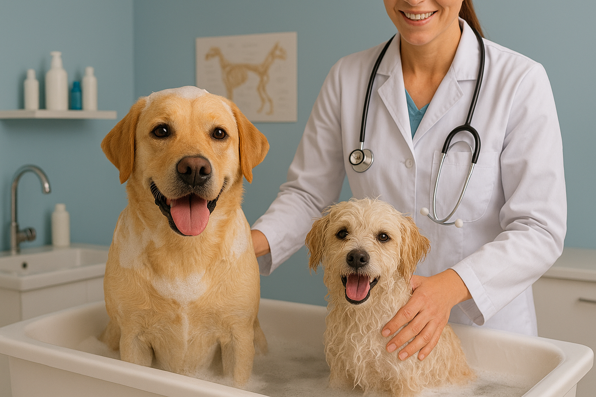
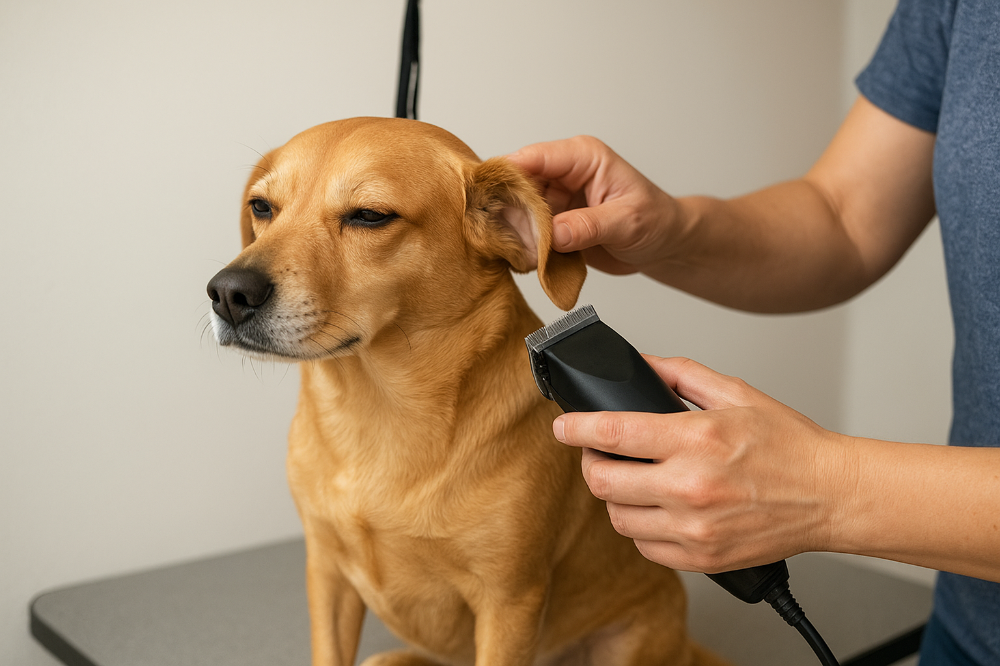
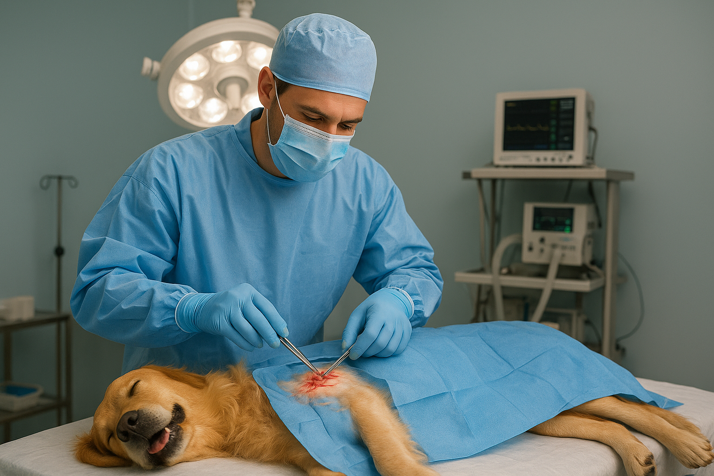
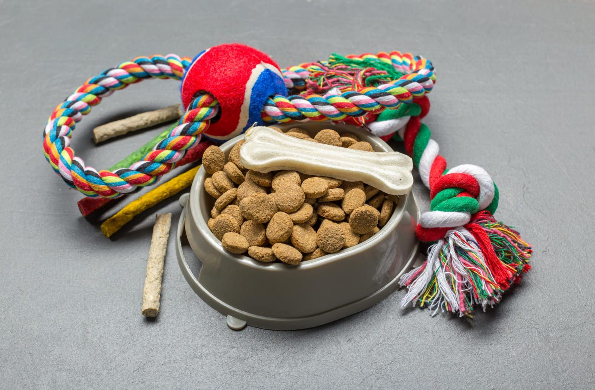
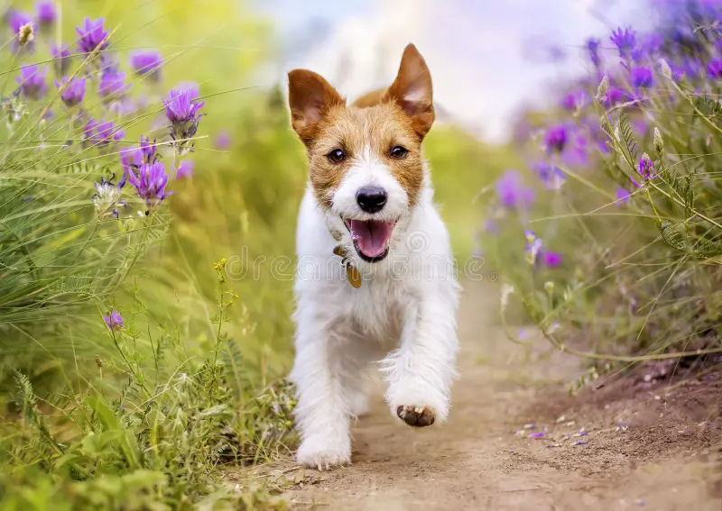

<html lang="es">
<head>
  <meta charset="utf-8" />
  <meta name="viewport" content="width=device-width,initial-scale=1" />
  <title>Clínica Veterinaria · Mis Mascotas — Anapoima</title>
  <meta name="description" content="Clínica Veterinaria Mis Mascotas en Anapoima — baños, peluquería, guardería, urgencias 24h, cirugías, exámenes y venta de medicamentos y accesorios.">

  <!-- Google Fonts -->
  <link href="https://fonts.googleapis.com/css2?family=Montserrat:wght@600;700&family=Open+Sans:wght@300;400;600&display=swap" rel="stylesheet">

  
</head>
<body>
  <!-- HEADER -->
  <header>
    

      

        <h1>Mis Mascotas</h1>
        <small>Clínica Veterinaria · Anapoima</small>
      

      <!-- Desktop nav -->
      <nav class="desktop" aria-label="Menú principal">
        <a href="#inicio">Inicio</a>
        <a href="#servicios">Servicios</a>
        <a href="#guarderia">Guardería</a>
        <a href="#nosotros">Nosotros</a>
        <a class="btn-cta pulse" href="https://wa.me/573054395826" target="_blank" rel="noopener">WhatsApp</a>
      </nav>

      <!-- Mobile toggle -->
      <label for="nav-toggle" class="mobile-btn" title="Abrir menú" aria-hidden="false">
        
      </label>
      <input id="nav-toggle" class="mobile-toggle" type="checkbox" />
      

        <a href="#inicio">Inicio</a>
        <a href="#servicios">Servicios</a>
        <a href="#guarderia">Guardería</a>
        <a href="#nosotros">Nosotros</a>
        <a href="#contacto" class="btn-ghost">Contacto</a>
      

    

  </header>

  <!-- INICIO / HERO -->
  <main id="main">
    <section id="inicio" aria-label="Inicio">
      

        

          <h2>Tu mascota merece lo mejor</h2>
          
En <strong>Clínica Veterinaria Mis Mascotas</strong> cuidamos la salud, la higiene y la felicidad de tu compañero. Atención profesional, servicios integrales y urgencias 24 horas.

          

            <a class="btn-cta" href="https://wa.me/573054395826" target="_blank" rel="noopener">Pedir cita (WhatsApp)</a>
            <a class="btn-ghost" href="#servicios">Ver servicios</a>
          

        

        

          
        

      

    </section>

    <!-- SERVICIOS -->
    <section id="servicios" aria-label="Servicios">
      

        <h3 class="section-title">Nuestros Servicios</h3>
        
Servicios para caninos, felinos, aves, conejos y peces — todo en un solo lugar.

        

          <!-- 1 Baño -->
          <article class="card" role="listitem" aria-labelledby="s1-title">
            
            

              <h3 id="s1-title">Baño y Aseo</h3>
              
Baño con shampoo y acondicionador, secado, perfume, limpieza de uñas y aseo general. Precio aproximado: <strong>$50.000 COP</strong>.

              

                Desde $50.000
                <a class="btn-cta" href="https://wa.me/573054395826" target="_blank" rel="noopener">Solicitar cita</a>
              

            

          </article>

          <!-- 2 Peluquería -->
          <article class="card" role="listitem" aria-labelledby="s2-title">
            
            

              <h3 id="s2-title">Peluquería Canina</h3>
              
Peluquería para todas las razas: cortes, peinados, colocación de pañoletas y estilizado. Precios: <strong>$30.000 - $60.000 COP</strong>.

              

                Cortes y estilizado
                <a class="btn-cta" href="https://wa.me/573054395826" target="_blank" rel="noopener">Solicitar</a>
              

            

          </article>

          <!-- 3 Medicamentos -->
          <article class="card" role="listitem" aria-labelledby="s3-title">
            
            

              <h3 id="s3-title">Venta de Medicamentos</h3>
              
Surtimos medicamentos y recetas para distintas especies. Recomendamos consulta previa con el médico veterinario.

              

                Recetas y surtido
                <a class="btn-cta" href="https://wa.me/573054395826" target="_blank" rel="noopener">Consultar</a>
              

            

          </article>

          <!-- 4 Exámenes -->
          <article class="card" role="listitem" aria-labelledby="s4-title">
            
            

              <h3 id="s4-title">Toma de Exámenes</h3>
              
Analíticas y pruebas diagnósticas con entrega de resultados y recomendaciones médicas.

              

                Diagnóstico
                <a class="btn-cta" href="https://wa.me/573054395826" target="_blank" rel="noopener">Solicitar</a>
              

            

          </article>

          <!-- 5 Cirugías -->
          <article class="card" role="listitem" aria-labelledby="s5-title">
            
            

              <h3 id="s5-title">Cirugías</h3>
              
Procedimientos programados y de emergencia con anestesia y control postoperatorio por personal calificado.

              

                Procedimientos
                <a class="btn-cta" href="https://wa.me/573054395826" target="_blank" rel="noopener">Consultar</a>
              

            

          </article>

          <!-- 6 Urgencias -->
          <article class="card" role="listitem" aria-labelledby="s6-title">
            
            

              <h3 id="s6-title">Urgencias 24h</h3>
              
Atención inmediata las 24 horas. Contáctanos por WhatsApp si tu mascota necesita atención urgente.

              

                24 / 7
                <a class="btn-cta" href="https://wa.me/573054395826" target="_blank" rel="noopener">Contactar Urgencias</a>
              

            

          </article>

          <!-- 7 Accesorios -->
          <article class="card" role="listitem" aria-labelledby="s7-title">
            
            

              <h3 id="s7-title">Venta de Accesorios</h3>
              
Collares, platos, juguetes, placas y más para consentir a tu amigo peludo.

              

                Catálogo
                <a class="btn-cta" href="https://wa.me/573054395826" target="_blank" rel="noopener">Ver catálogo</a>
              

            

          </article>

          <!-- 8 Guardería -->
          <article class="card" role="listitem" aria-labelledby="s8-title">
            
            

              <h3 id="s8-title">Guardería Canina</h3>
              
Espacios amplios y supervisados para que tu mascota juegue y socialice. Ideal para días cortos o estancias largas.

              

                Reserva
                <a class="btn-cta" href="https://wa.me/573054395826" target="_blank" rel="noopener">Reservar</a>
              

            

          </article>
        

      

    </section>
    <!-- CONTACTO -->
    <section id="contacto" aria-label="Contacto">
      

        <h3 class="section-title">Contacto</h3>
        
Dirección: Carrera 5 #10-32, Centro, Anapoima — Horario: Lunes a domingo 8:00 - 20:00. Urgencias 24h.

        

          

            
<strong>Teléfono</strong> <a href="wa.me/573054395826" target="_blank" rel="noopener"> 305 4395826 </a>

            
<strong>Email</strong> info@clinicamismascotas.com 

            
<strong>Nota</strong> Para reservar, envía nombre, servicio deseado y fecha aproximada.

          
          
          

        

      

    </section>
  </main>

  <!-- FOOTER -->
  <footer>
    

      

        <h4>Clínica Mis Mascotas</h4>
        
Carrera 5 #10-32, Centro — Anapoima, Cundinamarca

      

      

        <h4>Contacto</h4>
        
<a href="https://wa.me/573054395826" target="_blank" rel="noopener">WhatsApp / Teléfono</a>

        
Urgencias 24h

      

      

        <h4>Horario</h4>
        
Lun - Dom: 08:00 - 20:00

      

    

    
©  Clínica Veterinaria Mis Mascotas — Diseñado por Alex

  </footer>

  
</body>
</html>
